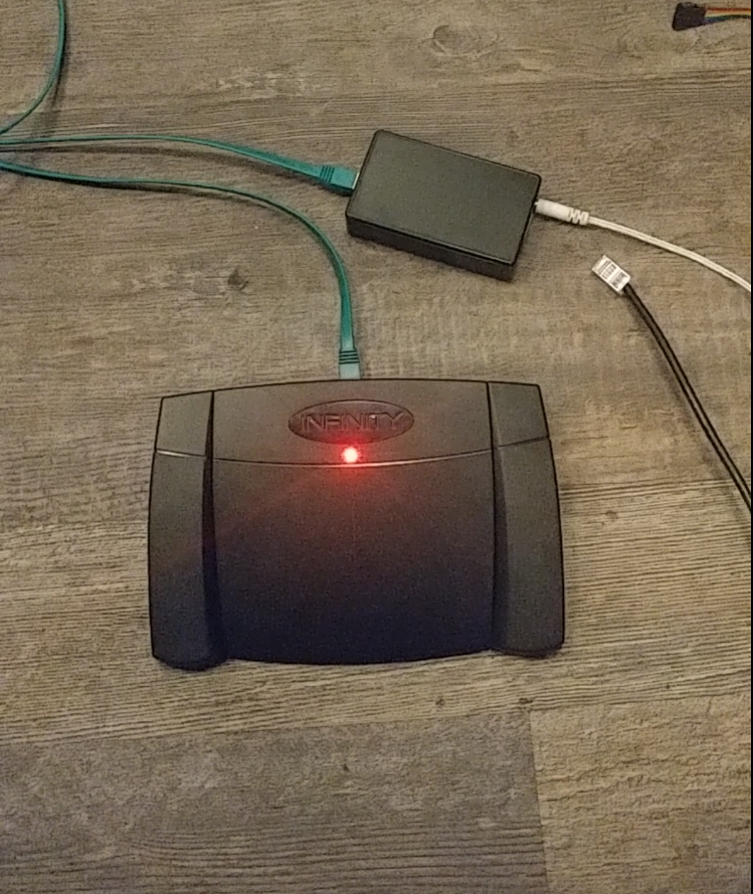
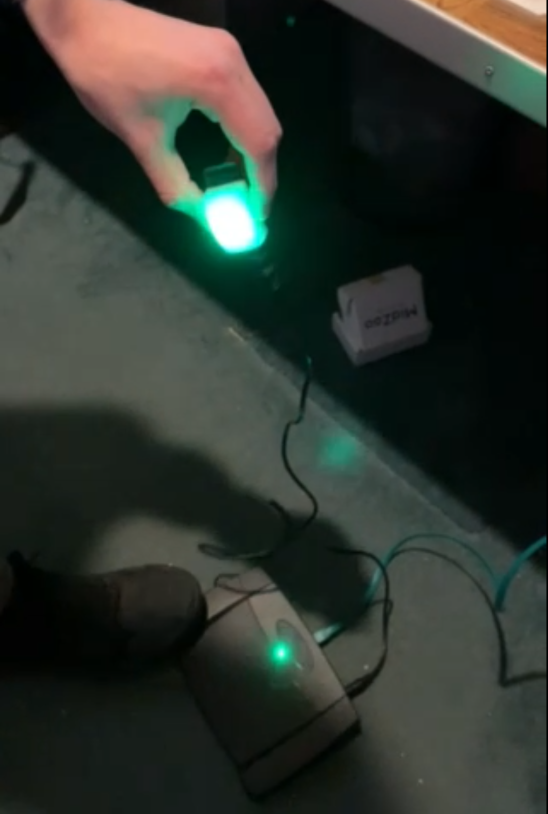
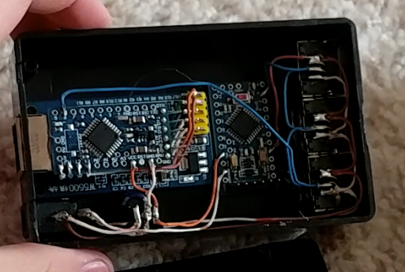
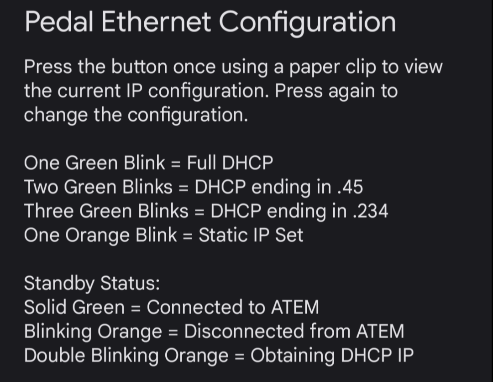

# Word Of Life - Amir Gorkovchenko (Mid-Late 2022)

This was a volunteer project I took for a neighboring church that I developed and successfully deployed.

Very similar to my RTX V2, but refreshed once again and redocumented. More extensive testing has been done and other features improved. This would be the RTX V2.1

Lots of the IP communication code (from RTX V2) has been modified for a different module (W5500 ethernet module)

New methods for button macros and LED macros have been developed

## Device Overview

The entire project consists of three primary devices that all work together for camera pedal control and tally lights

### Ethernet
This communicates with the ATEM video switcher for tally status and video switching.

It also contains a simple HTML wed interface for Ethernet configuration.

It reports tally status by polling target devices, ie. camera pedal device

### Pedal
This device is very similar to the RTX V2 RTX_CENTER_SIDE_SWITCHER.

It contains neopixels, one internal and one external.

One is built into the device and the second LED is external for the tally light located on the Camera's carried by an AUX cable.

One major difference from RTX V2 RTX_CENTER_SIDE_SWITCHER is that it does not connect to an external pedal.
Rather, the device was built into the pedal allowing for a more sleek and seamless design

Once again, the pedal received communication and power through a single cat cable and communication through a custom one-wire network.

### Master Interface
This is the master device that connects to the one-wire network and facilitates communication between slave devices (Ethernet and Pedal).
Only one is needed per network.
This provides reliable packet delivery between devices, even if receiver is busy.

## Photos
The Pedal with the built in Tally status. The Small box is the ethernet interface with master interface.\
The green cable carries three conductors, RTX OneWire Bus, 12v, and GND:

\
\
The External and built in status lights are show here. The external tally connects via AUX cable:

Testing Tallies over 30ft AUX

\
\
The inside of the Ethernet interface is shown here. Everything was custom cut and soldered.\
Two Arduino Pro minis (ethernet interface and master interface) together with a W5500

\
\
Configuration of the pedal Ethernet as follows:

## Videos
https://youtu.be/sTRpgctFRwg

https://youtu.be/4-CrCbQiMDo
